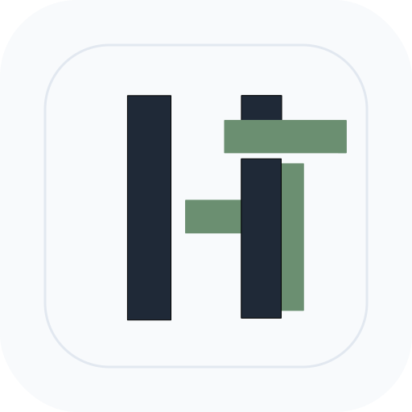

<p align="center">
  
</p>

<h1 align="center">HighTex Desktop</h1>

<p align="center">
  Editor tugas akhir versi desktop yang dibuat untuk HighTex.
</p>
<p align="center">
<a href="https://github.com/jefyokta/hightex-desktop/releases/latest">
  
</a>
</p>
<p align="center">
<a href="https://github.com/jefyokta/hightex-desktop/releases">
  
</a>
<a href="https://github.com/jefyokta/hightex-desktop/releases/latest">
  
</a>
</p>

<p align="center">
  <a href="./README.md">English</a> · <b>Bahasa Indonesia</b>
</p>

HighTex Desktop adalah versi desktop dari HighTex, aplikasi penulisan tugas akhir yang awalnya saya kembangkan sebagai proyek akhir kuliah.

Tujuannya sederhana: membantu mahasiswa fokus menulis tugas akhir, bukan berkutat dengan format dokumen.

---

## Kenapa HighTex?

> HighTex, ***High-Level of LaTeX***

HighTex berawal dari proyek akhir saya di program studi Sistem Informasi, UIN Sultan Syarif Kasim Riau.

Program studi kami mewajibkan tugas akhir mengikuti standar format akademik yang ketat, dan mahasiswa dianjurkan memakai LaTeX agar dokumen yang dihasilkan konsisten dan tampak profesional.

LaTeX memang sangat powerful, tetapi banyak mahasiswa baru mengenalnya saat mulai menulis tugas akhir. Akibatnya, banyak waktu habis untuk mempelajari perintah, memperbaiki masalah format, dan mencari solusi error kompilasi, alih-alih fokus pada penelitiannya.

HighTex dibuat sebagai upaya agar penulisan tugas akhir terasa lebih mudah didekati. Tujuannya bukan menggantikan standar akademik, melainkan membuatnya lebih mudah diikuti lewat pengalaman menulis yang lebih ramah pengguna.

Proyek ini awalnya berupa aplikasi web, lalu berkembang menjadi aplikasi desktop.

### Kenapa namanya HighTex, padahal tidak ada compiler LaTeX di dalamnya?

Nama ini lahir sebelum rancangan aplikasi yang sekarang.

Skripsi saya awalnya bertujuan mempermudah penulisan dengan LaTeX. Ide pertamanya adalah mengubah HTML menjadi kode LaTeX, lalu PDF-nya dihasilkan oleh compiler LaTeX, karena itu namanya *High-Level of LaTeX*. Dosen pembimbing saya menolak pendekatan itu: compiler LaTeX tidak diperlukan, yang penting dokumen tetap terformat sesuai standar.

Jadi proses kompilasi diganti dengan PDF yang dihasilkan browser. Nama HighTex tetap saya pakai, meskipun LaTeX sudah tidak menjadi bagian inti dari proses aplikasi.

### Dampaknya

Karena HighTex tidak lagi memakai kode LaTeX, beberapa aplikasi yang sebelumnya dipakai mahasiswa jadi tidak relevan lagi:

- **SmartTA** memeriksa dokumen lewat kode LaTeX-nya. HighTex tidak lagi menghasilkan kode LaTeX, sehingga SmartTA tidak dipakai lagi. Fungsinya digantikan oleh **HighTex Validator**.

---

## Kenapa Aplikasi Desktop?

### Tidak ada kejelasan jadwal deployment

Rencana awalnya, versi web akan di-deploy, tetapi sampai sekarang belum ada jawaban yang jelas kapan hal itu terjadi.

Teman-teman sering bertanya kapan aplikasinya bisa dipakai, dan saya tidak punya jawaban. Sebagai solusi sementara bagi yang membutuhkan, saya men-deploy-nya secara tidak resmi dan sesuai permintaan: hanya aktif ketika ada yang ingin memakainya, sambil menunggu deployment resmi.

Daripada menunggu tanpa kepastian, saya memutuskan membuat versi yang bisa langsung dipakai mahasiswa.

### Sumber daya server

Aplikasi web selalu datang dengan urusan infrastruktur. Harus ada yang menyediakan penyimpanan, mengurus backup, memantau penggunaan, dan membayar server.

Saya pernah mencoba men-deploy sendiri di server berspesifikasi kecil, tetapi tidak cukup: kompilasi dokumen memakan sumber daya besar, dan saya tidak mau terus mengeluarkan biaya lebih untuk aplikasi nonprofit.

Dengan aplikasi desktop, dokumen disimpan secara lokal di komputer pengguna, sehingga banyak batasan yang tadinya memengaruhi keputusan pengembangan ikut hilang.

### Offline first

Menulis tugas akhir seharusnya tidak bergantung pada ketersediaan internet.

Mahasiswa harus tetap bisa bekerja, baik di rumah, di kampus, maupun di tempat tanpa koneksi yang stabil.

### Lebih bebas bereksperimen

Ada banyak fitur yang sudah bertahun-tahun ingin saya buat, tetapi terus tertunda karena sulit dipertanggungjawabkan di lingkungan server:

- Berapa banyak penyimpanan yang akan terpakai?
- Berapa biaya untuk menjalankannya?
- Apakah akan memengaruhi pengguna lain?
- Apakah aman mengekspos fitur ini di server publik?

Pertanyaan-pertanyaan seperti ini sering menentukan apa yang bisa dan tidak bisa dibangun. Di desktop, sebagian besar kekhawatiran itu hilang, dan fitur bisa dirancang berdasarkan kebutuhan pengguna, bukan kemampuan server.

---

## Kenapa Electron?

Jawaban jujurnya: kepraktisan.

Terus terang, Electron bukan pilihan pertama saya seandainya sumber daya, waktu, dan tenaga untuk maintenance tidak terbatas. Aplikasi berbasis teknologi serupa sering dikritik karena memakai memori dan sumber daya sistem lebih banyak dibanding aplikasi desktop tradisional, dan siapa pun yang pernah memakai Discord atau WhatsApp Desktop mungkin pernah merasakannya. Saya memahami kritik itu.

Namun, HighTex dikembangkan terutama oleh satu orang, dan setiap keputusan teknis harus menyeimbangkan idealisme dengan realita.

### Fondasi yang sudah ada

HighTex sudah ada sebelum versi desktopnya. Banyak pekerjaan yang sudah dicurahkan untuk editor, sistem dokumen, dan antarmukanya.

Membangun ulang semuanya untuk tiap sistem operasi berarti menghabiskan bertahun-tahun mengulang pekerjaan yang sudah selesai.

### Konsistensi lintas platform

Mendukung banyak sistem operasi itu sulit. Implementasi terpisah berarti lebih kompleks, lebih banyak bug, dan lebih besar peluang fitur berperilaku berbeda di tiap platform.

Codebase yang sama menjaga perilaku tetap konsisten dan maintenance tetap terkelola.

### Kecepatan pengembangan

Setiap jam yang dipakai untuk membangun ulang infrastruktur adalah jam yang tidak dipakai untuk memperbaiki pengalaman menulis. Prioritas saya adalah meningkatkan HighTex itu sendiri, bukan memelihara beberapa versi platform-spesifik dari aplikasi yang sama.

### Saya ingin menyelesaikan proyek ini

Seperti banyak proyek pribadi dan akademik lainnya, HighTex bisa dengan mudah terjebak dalam siklus rewrite dan perbaikan arsitektur tanpa akhir. Pada titik tertentu, software harus bisa dipakai.

Electron mungkin bukan solusi yang paling elegan, tetapi inilah yang membuat HighTex Desktop bisa ada hari ini, bukan sekadar proyek yang tak pernah selesai. Untuk proyek ini, merilis lebih penting daripada mengejar kesempurnaan.

---

## Status Saat Ini

HighTex Desktop masih dalam pengembangan aktif. Fitur, arsitektur, dan alur kerja mungkin terus berubah seiring proyek berkembang.

## Catatan untuk macOS

Build macOS yang didistribusikan lewat GitHub Releases belum ditandatangani (unsigned) dan belum dinotarisasi. Hal ini menyebabkan dua masalah yang diketahui saat instalasi dan pembaruan.

### Instalasi

Setelah mengunduh DMG, macOS mungkin memblokir aplikasi dengan pesan seperti `"HighTex" is damaged and can't be opened`. Ini wajar untuk build yang belum ditandatangani.

Untuk mengatasinya, jalankan perintah berikut setelah memindahkan HighTex ke `/Applications`:

```sh
xattr -cr /Applications/HighTex.app
```

Lalu buka HighTex seperti biasa.

### Pembaruan

Auto-updater bawaan berhasil mengunduh pembaruan, tetapi Squirrel.Mac memerlukan sertifikat Apple Developer yang valid untuk menerapkannya. Karena build belum ditandatangani, pembaruan terunduh tetapi tidak pernah terpasang.

Setelah updater selesai mengunduh, terapkan pembaruan secara manual:

```sh
rm -rf /Applications/HighTex.app && unzip ~/Library/Caches/hightex-desktop-updater/update.zip -d /Applications/
```

Lalu jalankan ulang HighTex.

Keterbatasan ini akan teratasi setelah build macOS ditandatangani dan dinotarisasi dengan sertifikat Apple Developer.